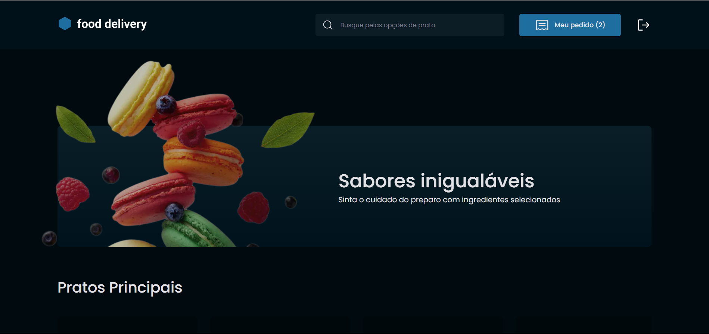

# Food Delivery

Food Delivery é uma aplicação que simula um site de restaurante. O design foi baseado no desafio Food Explorer do programa de formação e aceleração de carreira Explorer da [Rocketseat](https://github.com/Rocketseat). Porém algumas funcionalidades foram alteradas.

Esse projeto possui as seguintes funcionalidades:

- Autenticação com o Google _(feature adicional)_
- Autenticação com email e senha
- Adição e remoção de itens do carrinho
- Checkout de pagamento com Stripe _(feature adicional)_ - **Funcionalidade removida por sinalização de phishing pelos navegadores**

## Tecnologias

- NextJS
- Typescript
- FaunaDB
- Redux com Toolkit
- Styled Components
- Stripe

## Demo

[Projeto em produção](https://food-delivery-jso.vercel.app/)
